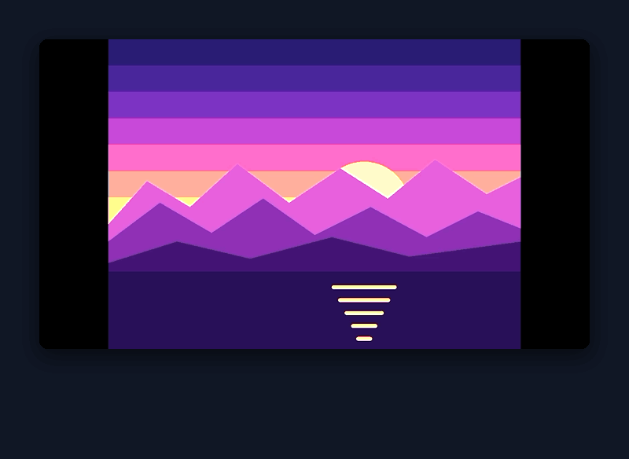
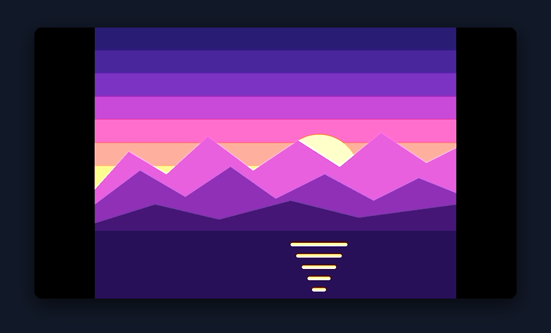
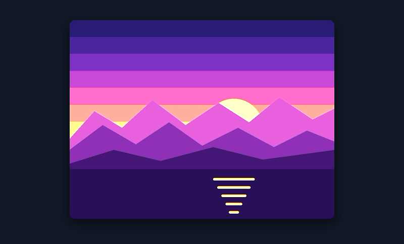
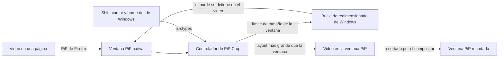

<div align="center">
  

  # PiP Crop

  **Recorta la ventana nativa de Picture-in-Picture de Firefox y LibreWolf.**

  Mantén Shift y arrastra un borde de la ventana PiP para cortar las barras negras o cualquier lado del video. La ventana se encoge junto con el video: sin zoom, sin estirar y sin barras negras.

  <p>
    <a href="https://github.com/TechBeme/pip-crop/releases/latest"><strong>Descargar</strong></a>
    |
    <a href="#por-qué-pip-crop">Funciones</a>
    |
    <a href="#navegadores-compatibles">Navegadores</a>
    |
    <a href="#inicio-rápido">Inicio rápido</a>
    |
    <a href="CONTRIBUTING.md">Contribuir</a>
  </p>

  <p>
    <a href="https://github.com/TechBeme/pip-crop/actions/workflows/ci.yml"></a>
    <a href="LICENSE"></a>
    <a href="https://github.com/TechBeme/pip-crop/releases/latest"></a>
    <a href="https://librewolf.net"></a>
    <a href="https://www.firefox.com"></a>
    <a href="https://github.com/TechBeme/pip-crop/stargazers"></a>
  </p>

  **Idiomas:** [🇺🇸 English](README.md) · [🇧🇷 Português](README.pt-BR.md) · 🇪🇸 Español

  <p>
    <a href="https://github.com/TechBeme/pip-crop/releases/latest"></a>
  </p>
</div>



## ¿Por qué PiP Crop?

PiP Crop es un complemento open source para Firefox y LibreWolf que recorta la ventana nativa de Picture-in-Picture (PiP) del navegador. El PiP de Firefox siempre muestra el cuadro completo: las películas con letterbox, los programas 4:3 con barras laterales y los videos verticales en un cuadro 16:9 traen barras negras, y a menudo de un directo solo quieres seguir una parte. PiP Crop recorta la propia ventana PiP:

- **Corta barras negras y bordes que sobran** manteniendo Shift y arrastrando cualquier borde o esquina de la ventana PiP.
- **La ventana se encoge de verdad.** Si recortas un 10% de cada lado de una ventana de 600×338, obtienes una ventana de 480×338 con el 80% central del video, a la misma escala.
- **Sin zoom, sin estirar, sin barras negras.** Arrastrar un borde hacia afuera deshace el recorte, y el borde se detiene exactamente en el límite del video.
- **Mantén varias ventanas PiP abiertas**, cada una con su propio recorte.
- **Úsalo con cualquier video que Firefox abra en Picture-in-Picture**, incluso videos de otro origen y con DRM, porque nunca lee los píxeles del video.
- **Sin programas extra y sin CPU extra.** A diferencia de herramientas de captura de pantalla como PowerToys Crop and Lock u OnTopReplica, el recorte ocurre dentro de la propia ventana PiP del navegador: sin segunda ventana, con la calidad original del video y con los controles del PiP funcionando.

## Capturas de pantalla

| Antes: barras negras en la ventana PiP | Después: Shift + arrastrar, la ventana se encoge |
| --- | --- |
|  |  |

### Varias ventanas PiP, cada una con su recorte


## Navegadores compatibles

| Navegador | Plataforma | Paquete | Actualizaciones | Estado |
| --- | --- | --- | --- | --- |
| LibreWolf 140+ | Windows | Instalador o `.xpi` | Automáticas | Probado en 156.0 |
| Firefox 140+ (release) | Windows | Instalador o zip de AutoConfig | Ejecutar el nuevo instalador | Probado en 156.0.1 |
| Firefox Developer Edition / Nightly | Windows | extensión `.xpi` | Automáticas | Debería funcionar, sin probar |
| Linux y macOS | | | | Modo alternativo sin lectura nativa de teclado y ratón, sin probar |

Probado en Windows 11 con pantallas al 100% y al 125%. La [instalación](docs/installation.md) cubre todos los navegadores, las actualizaciones y la solución de problemas (en inglés).

## Funciones

- Shift + arrastrar cualquier borde o esquina de la ventana PiP nativa recorta ese lado
- Arrastrar hacia afuera deshace el recorte; el borde se detiene en el límite del video
- Shift + doble clic quita el recorte
- Arrastrar normalmente sigue redimensionando en proporción y conserva el recorte
- El video queda quieto en pantalla mientras recortas; solo se mueve el borde de la ventana
- Un recorte independiente para cada ventana PiP
- El recorte se mantiene cuando cambia la resolución (streaming adaptativo) y en pantalla completa (con letterbox)
- Funciona con videos de otro origen, sin CORS y con DRM (EME)
- Aparece un contorno mientras mantienes Shift sobre la ventana
- Alt en lugar de Shift, como opción (`extensions.pipcrop.modifier`)
- Instalador de un clic para Windows, para LibreWolf y Firefox, en inglés, portugués y español
- Actualizaciones automáticas desde las releases de GitHub en LibreWolf
- No recopila datos ni hace peticiones de red por su cuenta

## Stack tecnológica

[](src/pipcrop.js)
[](https://firefox-source-docs.mozilla.org/toolkit/components/extensions/webextensions/basics.html#adding-experimental-apis-in-privileged-extensions)
[](docs/architecture.md)
[](tools/build.py)
[](installer/pip-crop.iss)
[](.github/workflows/ci.yml)

- Un único módulo JavaScript privilegiado, [`src/pipcrop.js`](src/pipcrop.js), sin dependencias
- Un envoltorio de WebExtension Experiment para LibreWolf y un cargador de AutoConfig para Firefox release
- Llamadas js-ctypes a Win32: `GetAsyncKeyState`, `GetCursorPos`, `WM_NCHITTEST`, `WM_GETMINMAXINFO`, `GetGUIThreadInfo`
- Un instalador Inno Setup que modifica los navegadores elegidos y deshace todo al desinstalar
- Build reproducible en Python, el linter de complementos de Mozilla y releases con GitHub Actions y un `updates.json` propio
- Pruebas de extremo a extremo en un navegador real mediante Marionette, verificadas con capturas de pantalla

## Arquitectura



PiP Crop se ejecuta en el proceso principal del navegador y se engancha al módulo `PictureInPicture` de Firefox para acompañar cada ventana PiP. Dentro de la ventana, el video es más grande que la ventana y el compositor recorta lo que sobra, así que el recorte cuesta prácticamente lo mismo que el PiP normal. Mientras mantienes Shift sobre un borde, PiP Crop limita el tamaño de la ventana al borde del video antes del clic, y el propio bucle de redimensionado de Windows detiene el borde ahí.

Consulta la [arquitectura](docs/architecture.md) para el gesto, los detalles de Windows y la organización de los archivos, y las [notas de investigación](docs/research.md) para los enfoques probados y descartados, con mediciones (en inglés).

## Inicio rápido

### Requisitos previos

- Windows 10 u 11
- LibreWolf o Firefox 140 o más reciente (probado en 156), abierto al menos una vez

### 1. Descarga el instalador

Descarga `pip-crop-<versión>-setup.exe` de la [última release](https://github.com/TechBeme/pip-crop/releases/latest).

### 2. Ejecútalo

Abre el archivo y haz clic en **Siguiente** y luego en **Instalar**. El instalador encuentra LibreWolf y Firefox por sí solo y añade PiP Crop a los que marques. Windows pide permiso, porque la carpeta de Firefox está protegida: haz clic en **Sí**.

Cuando termine, cierra el navegador por completo y vuelve a abrirlo.

> [!NOTE]
> Windows puede mostrar "Windows protegió su PC", porque el instalador no está firmado con un certificado de pago. Haz clic en **Más información** y luego en **Ejecutar de todas formas**. El instalador lo genera GitHub Actions a partir del código de este repositorio, y el `SHA256SUMS.txt` de la release tiene su checksum.

Para quitar PiP Crop, ve a Configuración → Aplicaciones → Aplicaciones instaladas → PiP Crop → Desinstalar.

### 3. Recorta una ventana PiP

Abre cualquier video en Picture-in-Picture y:

| Gesto | Qué hace |
| --- | --- |
| **Shift** + arrastrar un borde o una esquina | Recorta ese lado: el borde se mueve y el video queda quieto |
| **Shift** + arrastrar hacia afuera | Deshace el recorte, hasta el límite del video |
| **Shift** + doble clic | Quita el recorte |
| Arrastrar un borde o una esquina | Redimensiona en proporción; el recorte se conserva |

### Instalación manual

**LibreWolf.** En `about:config`, pon `xpinstall.signatures.required` en `false` y `extensions.experiments.enabled` en `true`. Luego abre `about:addons`, haz clic en el engranaje, elige la opción de instalar desde un archivo (**Install Add-on From File…**) y selecciona `pip-crop-<versión>.xpi`.

**Firefox.** Extrae `pip-crop-<versión>-firefox-autoconfig.zip`, abre PowerShell **como administrador** en esa carpeta y ejecuta:

```powershell
powershell -ExecutionPolicy Bypass -File install.ps1
```

Reinicia Firefox. Para quitarlo, ejecuta `install.ps1 -Uninstall`.

### Compilar desde el código

```bash
git clone https://github.com/TechBeme/pip-crop.git
cd pip-crop
python tools/build.py
```

Los paquetes quedan en `dist/`. Solo necesitas Python 3.

## ¿Por qué PiP Crop no está en addons.mozilla.org?

Los complementos de addons.mozilla.org solo pueden usar las APIs de WebExtension, y ninguna llega a la ventana PiP, que pertenece al navegador y no a una página. PiP Crop es una *WebExtension Experiment*, un complemento que trae su propia API privilegiada:

- addons.mozilla.org rechaza los experiments con "You cannot submit this type of add-on", y su linter marca `MANIFEST_FIELD_PRIVILEGED` en ellos.
- Firefox release ignora los experiments que Mozilla no ha firmado como privilegiados.

Por eso PiP Crop se distribuye desde las releases de GitHub: un instalador para Windows que sirve para los dos navegadores, además del `.xpi` para LibreWolf (con actualizaciones automáticas) y del paquete de AutoConfig para Firefox.

> [!WARNING]
> PiP Crop se ejecuta con todos los privilegios del navegador, como cualquier WebExtension Experiment o script de AutoConfig. Instálalo solo desde las releases de este repositorio, o compílalo desde un código que hayas revisado. Todo el código está en un archivo legible, [`src/pipcrop.js`](src/pipcrop.js).

## Comandos

| Comando | Para qué |
| --- | --- |
| `python tools/build.py` | Genera el `.xpi` y el zip de AutoConfig en `dist/` |
| `python tools/build.py --repo DUEÑO/NOMBRE` | También define la homepage y la URL de actualización y genera `updates.json` |
| `python tools/lint.py` | Ejecuta el linter de complementos de Mozilla (necesita Node.js) |
| `ISCC /DAppVersion=1.3.0 installer\pip-crop.iss` | Genera el instalador para Windows (Inno Setup 6.7) |
| `python tools/changelog.py 1.2.0` | Muestra las notas de una versión |
| `python tests/e2e/t_sim.py` | Ejecuta las pruebas de gestos en un navegador real (Windows) |

## Documentación

En inglés:

- [Instalación](docs/installation.md): LibreWolf, Firefox, actualizaciones, ajustes, solución de problemas y limitaciones conocidas
- [Arquitectura](docs/architecture.md): cómo funcionan el recorte y el gesto con Shift dentro de la ventana PiP
- [Notas de investigación](docs/research.md): enfoques probados y descartados, con mediciones
- [Pruebas](tests/README.md): pruebas de extremo a extremo en un navegador real
- [Changelog](CHANGELOG.md): qué cambió en cada versión
- [Cómo contribuir](CONTRIBUTING.md): flujo de desarrollo, pull requests y releases
- [Política de seguridad](SECURITY.md): cómo informar vulnerabilidades

## Cómo contribuir

Lee [CONTRIBUTING.md](CONTRIBUTING.md), crea una rama enfocada, ejecuta `python tools/build.py` y `python tools/lint.py` y abre un pull request. Son bienvenidas las contribuciones para Linux y macOS, mejoras del gesto, traducciones y pruebas. Si el proyecto te resulta útil, **dale una estrella al repositorio** y compártelo con quien vea videos en Picture-in-Picture.

## Seguridad y aviso legal

No informes vulnerabilidades en issues públicas; sigue [SECURITY.md](SECURITY.md). PiP Crop es independiente y no está afiliado a Mozilla, LibreWolf ni Microsoft. Firefox es una marca de la Mozilla Foundation; PowerToys, OnTopReplica y otros nombres pertenecen a sus respectivos dueños. Eres responsable de instalar código privilegiado en tu navegador y de cumplir los términos de los sitios que ves.

## Licencia

Publicado bajo la [Licencia MIT](LICENSE).

---

<div align="center">

**Developed by [Rafael Vieira](https://github.com/TechBeme)**

[](https://github.com/TechBeme)
[](https://www.fiverr.com/tech_be)
[](https://www.upwork.com/freelancers/~01f0abcf70bbd95376)
[](mailto:contact@techbe.me)

</div>
