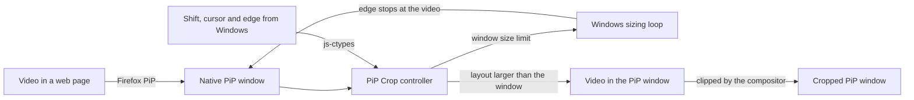

<div align="center">
  

  # PiP Crop

  **Crop the native Picture-in-Picture video window in Firefox and LibreWolf.**

  Hold Shift and drag an edge of the PiP window to cut black bars or any side of a video. The window shrinks with the video: no zoom, no stretching, no black bars.

  <p>
    <a href="https://github.com/TechBeme/pip-crop/releases/latest"><strong>Download</strong></a>
    |
    <a href="#why-pip-crop">Features</a>
    |
    <a href="#supported-browsers">Browsers</a>
    |
    <a href="#quick-start">Quick Start</a>
    |
    <a href="CONTRIBUTING.md">Contribute</a>
  </p>

  <p>
    <a href="https://github.com/TechBeme/pip-crop/actions/workflows/ci.yml"></a>
    <a href="LICENSE"></a>
    <a href="https://github.com/TechBeme/pip-crop/releases/latest"></a>
    <a href="https://librewolf.net"></a>
    <a href="https://www.firefox.com"></a>
    <a href="https://github.com/TechBeme/pip-crop/stargazers"></a>
  </p>

  **Languages:** 🇺🇸 English · [🇧🇷 Português](README.pt-BR.md) · [🇪🇸 Español](README.es.md)

  <p>
    <a href="https://github.com/TechBeme/pip-crop/releases/latest"></a>
  </p>
</div>


## Why PiP Crop?

PiP Crop is an open-source add-on for Firefox and LibreWolf that crops the browser's native Picture-in-Picture (PiP) video window. Firefox's PiP always shows the whole frame, so letterboxed films, pillarboxed 4:3 shows and vertical clips in a 16:9 frame come with black bars, and a stream often has only one part you want to keep an eye on. PiP Crop lets you cut the PiP window itself:

- **Cut black bars and unwanted edges** by holding Shift and dragging any edge or corner of the PiP window.
- **The window really shrinks.** Crop 10% off each side of a 600×338 window and you get a 480×338 window with the middle 80% of the video, at the same scale.
- **No zoom, no stretching, no black bars.** Dragging an edge outward uncrops it, and the edge stops exactly at the edge of the video.
- **Keep several PiP windows open**, each with its own crop.
- **Use it on any video Firefox can open in Picture-in-Picture**, including cross-origin and DRM-protected video, because it never reads the video's pixels.
- **No extra programs and no extra CPU.** Unlike screen-capture tools such as PowerToys Crop and Lock or OnTopReplica, the crop happens inside the browser's own PiP window: no second window, full video quality, and the PiP controls keep working.

## Screenshots

| Before: black bars in the PiP window | After: Shift + drag, the window shrinks |
| --- | --- |
|  |  |

### Several PiP windows, each with its own crop


## Supported browsers

| Browser | Platform | Package | Updates | Status |
| --- | --- | --- | --- | --- |
| LibreWolf 140+ | Windows | Installer or `.xpi` | Automatic | Tested on 156.0 |
| Firefox 140+ (release) | Windows | Installer or AutoConfig zip | Run the new installer | Tested on 156.0.1 |
| Firefox Developer Edition / Nightly | Windows | `.xpi` extension | Automatic | Should work, untested |
| Linux and macOS | | | | Fallback without native input, untested |

Tested on Windows 11 with displays at 100% and 125%. [Installation](docs/installation.md) covers every browser, updates and troubleshooting.

## Features

- Shift + drag any edge or corner of the native PiP window to crop that side
- Drag outward to uncrop; the edge stops at the edge of the video
- Shift + double-click to reset the crop
- Normal drags keep resizing proportionally, with the crop kept
- The video stays still on screen while you crop; only the window edge moves
- An independent crop for every PiP window
- The crop survives resolution changes (adaptive streaming) and fullscreen (letterboxed)
- Works with cross-origin, CORS-less and DRM (EME) video
- An outline shows while Shift is held over the window
- Alt instead of Shift, as an option (`extensions.pipcrop.modifier`)
- A one-click Windows installer for LibreWolf and Firefox, in English, Portuguese and Spanish
- Automatic updates from GitHub releases in LibreWolf
- No data collection and no network requests of its own

## Tech stack

[](src/pipcrop.js)
[](https://firefox-source-docs.mozilla.org/toolkit/components/extensions/webextensions/basics.html#adding-experimental-apis-in-privileged-extensions)
[](docs/architecture.md)
[](tools/build.py)
[](installer/pip-crop.iss)
[](.github/workflows/ci.yml)

- One privileged JavaScript module, [`src/pipcrop.js`](src/pipcrop.js), with no dependencies
- A WebExtension Experiment wrapper for LibreWolf and an AutoConfig loader for Firefox release
- js-ctypes calls into Win32: `GetAsyncKeyState`, `GetCursorPos`, `WM_NCHITTEST`, `WM_GETMINMAXINFO`, `GetGUIThreadInfo`
- An Inno Setup installer that edits the selected browsers and undoes every change on uninstall
- A reproducible Python build, Mozilla's add-on linter, and GitHub Actions releases with a self-hosted `updates.json`
- End-to-end tests on a real browser through Marionette, checked against screenshots

## Architecture



PiP Crop runs in the browser's parent process and hooks Firefox's `PictureInPicture` module to attach to every PiP window. Inside the window, the video is laid out larger than the window and the compositor clips it, so the crop costs about the same as plain PiP. While Shift is held over an edge, PiP Crop caps the window size at the edge of the video before you click, so Windows' own sizing loop stops the edge there.

See [Architecture](docs/architecture.md) for the gesture, the Windows details and the file layout, and [Research notes](docs/research.md) for the approaches that were tried and dropped, with measurements.

## Quick start

### Prerequisites

- Windows 10 or 11
- LibreWolf or Firefox 140 or newer (tested on 156), opened at least once

### 1. Download the installer

Download `pip-crop-<version>-setup.exe` from the [latest release](https://github.com/TechBeme/pip-crop/releases/latest).

### 2. Run it

Open the file and click **Next**, then **Install**. The installer finds LibreWolf and Firefox by itself and adds PiP Crop to the ones you check. Windows asks for permission, because Firefox's folder is protected: click **Yes**.

When it finishes, close the browser completely and open it again.

> [!NOTE]
> Windows may show "Windows protected your PC", because the installer is not signed with a paid certificate. Click **More info**, then **Run anyway**. The installer is built by GitHub Actions from this repository's code, and the release's `SHA256SUMS.txt` has its checksum.

To remove PiP Crop, go to Settings → Apps → Installed apps → PiP Crop → Uninstall.

### 3. Crop a PiP window

Open any video in Picture-in-Picture, then:

| Gesture | What it does |
| --- | --- |
| **Shift** + drag an edge or corner | Crops that side: the edge moves, the video stays still |
| **Shift** + drag outward | Uncrops, up to the edge of the video |
| **Shift** + double-click | Removes the crop |
| Drag an edge or corner | Normal proportional resize; the crop is kept |

### Manual installation

**LibreWolf.** In `about:config`, set `xpinstall.signatures.required` to `false` and `extensions.experiments.enabled` to `true`. Then open `about:addons`, click the gear icon, choose **Install Add-on From File…** and pick `pip-crop-<version>.xpi`.

**Firefox.** Extract `pip-crop-<version>-firefox-autoconfig.zip`, open PowerShell **as Administrator** in that folder and run:

```powershell
powershell -ExecutionPolicy Bypass -File install.ps1
```

Restart Firefox. Run `install.ps1 -Uninstall` to remove it.

### Build from source

```bash
git clone https://github.com/TechBeme/pip-crop.git
cd pip-crop
python tools/build.py
```

The packages are written to `dist/`. Only Python 3 is needed.

## Why isn't PiP Crop on addons.mozilla.org?

Extensions on addons.mozilla.org can only use the WebExtension APIs, and none of them reach the PiP window, which belongs to the browser rather than to a web page. PiP Crop is a *WebExtension Experiment*, an extension that brings its own privileged API:

- addons.mozilla.org rejects experiments with "You cannot submit this type of add-on", and its linter reports `MANIFEST_FIELD_PRIVILEGED` for them.
- Firefox release ignores experiments that Mozilla has not signed as privileged.

So PiP Crop is distributed from GitHub releases: a Windows installer for both browsers, plus the `.xpi` for LibreWolf (with automatic updates) and the AutoConfig package for Firefox.

> [!WARNING]
> PiP Crop runs with the browser's full privileges, like every WebExtension Experiment and AutoConfig script. Install it only from this repository's releases, or build it from source you have reviewed. All of the code is in one readable file, [`src/pipcrop.js`](src/pipcrop.js).

## Commands

| Command | Purpose |
| --- | --- |
| `python tools/build.py` | Build the `.xpi` and the Firefox AutoConfig zip into `dist/` |
| `python tools/build.py --repo OWNER/NAME` | Also set the homepage and update URL and write `updates.json` |
| `python tools/lint.py` | Run Mozilla's add-on linter (needs Node.js) |
| `ISCC /DAppVersion=1.3.0 installer\pip-crop.iss` | Build the Windows installer (Inno Setup 6.7) |
| `python tools/changelog.py 1.2.0` | Print the release notes of a version |
| `python tests/e2e/t_sim.py` | Run the gesture tests on a real browser (Windows) |

## Documentation

- [Installation](docs/installation.md): LibreWolf, Firefox, updates, settings, troubleshooting and known limitations
- [Architecture](docs/architecture.md): how the crop and the Shift gesture work inside the PiP window
- [Research notes](docs/research.md): approaches that were tried and dropped, with measurements
- [Tests](tests/README.md): end-to-end tests on a real browser
- [Changelog](CHANGELOG.md): what changed in each version
- [Contributing](CONTRIBUTING.md): development workflow, pull requests and releases
- [Security policy](SECURITY.md): responsible vulnerability reporting

## Contributing

Contributions are welcome, from Linux and macOS support to gesture improvements, documentation, translations and tests.

1. Read [CONTRIBUTING.md](CONTRIBUTING.md).
2. Fork the repository and create a focused branch.
3. Run `python tools/build.py` and `python tools/lint.py`.
4. Open a pull request using the provided template.

If PiP Crop is useful to you, **star the repository** and share it with someone who watches videos in Picture-in-Picture.

## Security

Do not report vulnerabilities in public issues. Follow [SECURITY.md](SECURITY.md) and never include personal browsing data or private videos in reports.

## Disclaimer

PiP Crop is an independent open-source project. It is not affiliated with, endorsed by, or sponsored by Mozilla, LibreWolf or Microsoft. Firefox is a trademark of the Mozilla Foundation; PowerToys, OnTopReplica and other product names belong to their respective owners. Browser internals can change between versions.

You are responsible for installing privileged code in your browser and for complying with the terms of the sites you watch.

## License

Released under the [MIT License](LICENSE).

---

<div align="center">

**Developed by [Rafael Vieira](https://github.com/TechBeme)**

[](https://github.com/TechBeme)
[](https://www.fiverr.com/tech_be)
[](https://www.upwork.com/freelancers/~01f0abcf70bbd95376)
[](mailto:contact@techbe.me)

</div>
