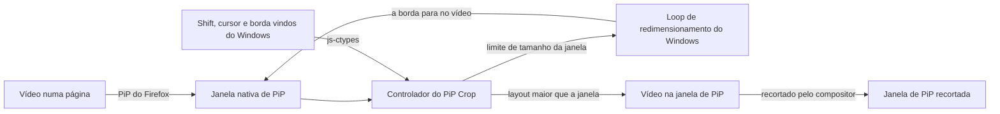

<div align="center">
  

  # PiP Crop

  **Recorte a janela nativa de Picture-in-Picture do Firefox e do LibreWolf.**

  Segure Shift e arraste uma borda da janela de PiP para cortar barras pretas ou qualquer lado do vídeo. A janela encolhe junto com o vídeo: sem zoom, sem esticar e sem barras pretas.

  <p>
    <a href="https://github.com/TechBeme/pip-crop/releases/latest"><strong>Baixar</strong></a>
    |
    <a href="#por-que-pip-crop">Recursos</a>
    |
    <a href="#navegadores-suportados">Navegadores</a>
    |
    <a href="#início-rápido">Início rápido</a>
    |
    <a href="CONTRIBUTING.md">Contribuir</a>
  </p>

  <p>
    <a href="https://github.com/TechBeme/pip-crop/actions/workflows/ci.yml"></a>
    <a href="LICENSE"></a>
    <a href="https://github.com/TechBeme/pip-crop/releases/latest"></a>
    <a href="https://librewolf.net"></a>
    <a href="https://www.firefox.com"></a>
    <a href="https://github.com/TechBeme/pip-crop/stargazers"></a>
  </p>

  **Idiomas:** [🇺🇸 English](README.md) · 🇧🇷 Português · [🇪🇸 Español](README.es.md)

  <p>
    <a href="https://github.com/TechBeme/pip-crop/releases/latest"></a>
  </p>
</div>


## Por que PiP Crop?

O PiP Crop é uma extensão open source para Firefox e LibreWolf que recorta a janela nativa de Picture-in-Picture (PiP) do navegador. O PiP do Firefox sempre mostra o quadro inteiro: filmes com letterbox, programas 4:3 com barras laterais e vídeos verticais num quadro 16:9 vêm com barras pretas, e muitas vezes você só quer acompanhar uma parte de uma live. O PiP Crop corta a própria janela de PiP:

- **Corte barras pretas e bordas indesejadas** segurando Shift e arrastando qualquer borda ou canto da janela de PiP.
- **A janela encolhe de verdade.** Cortando 10% de cada lado de uma janela de 600×338, fica uma janela de 480×338 com os 80% do meio do vídeo, na mesma escala.
- **Sem zoom, sem esticar, sem barras pretas.** Arrastar uma borda para fora desfaz o corte, e a borda para exatamente no limite do vídeo.
- **Mantenha várias janelas de PiP abertas**, cada uma com o seu corte.
- **Use em qualquer vídeo que o Firefox abra em Picture-in-Picture**, inclusive vídeos de outra origem e com DRM, porque ele nunca lê os pixels do vídeo.
- **Sem programas extras e sem CPU extra.** Ao contrário de ferramentas de captura de tela como o PowerToys Crop and Lock ou o OnTopReplica, o corte acontece dentro da própria janela de PiP do navegador: sem segunda janela, com a qualidade original do vídeo e com os controles do PiP funcionando.

## Capturas de tela

| Antes: barras pretas na janela de PiP | Depois: Shift + arrastar, a janela encolhe |
| --- | --- |
|  |  |

### Várias janelas de PiP, cada uma com o seu corte


## Navegadores suportados

| Navegador | Plataforma | Pacote | Atualizações | Status |
| --- | --- | --- | --- | --- |
| LibreWolf 140+ | Windows | extensão `.xpi` | Automáticas | Testado no 156.0 |
| Firefox 140+ (release) | Windows | zip do AutoConfig + instalador | Rodar o instalador novo | Testado no 156.0.1 |
| Firefox Developer Edition / Nightly | Windows | extensão `.xpi` | Automáticas | Deve funcionar, não testado |
| Linux e macOS | | | | Modo alternativo sem leitura nativa de teclado e mouse, não testado |

Testado no Windows 11 com telas a 100% e 125%. A [instalação](docs/installation.md) cobre todos os navegadores, atualizações e solução de problemas (em inglês).

## Recursos

- Shift + arrastar qualquer borda ou canto da janela nativa de PiP corta aquele lado
- Arrastar para fora desfaz o corte; a borda para no limite do vídeo
- Shift + duplo clique remove o corte
- O arrasto normal continua redimensionando na proporção, mantendo o corte
- O vídeo fica parado na tela enquanto você corta; só a borda da janela anda
- Um corte independente para cada janela de PiP
- O corte continua valendo quando a resolução muda (streaming adaptativo) e em tela cheia (com letterbox)
- Funciona com vídeo de outra origem, sem CORS e com DRM (EME)
- Um contorno aparece enquanto o Shift está pressionado sobre a janela
- Alt no lugar de Shift, como opção (`extensions.pipcrop.modifier`)
- Atualizações automáticas pelas releases do GitHub no LibreWolf
- Não coleta dados e não faz requisições de rede por conta própria

## Stack técnica

[](src/pipcrop.js)
[](https://firefox-source-docs.mozilla.org/toolkit/components/extensions/webextensions/basics.html#adding-experimental-apis-in-privileged-extensions)
[](docs/architecture.md)
[](tools/build.py)
[](.github/workflows/ci.yml)

- Um único módulo JavaScript privilegiado, [`src/pipcrop.js`](src/pipcrop.js), sem dependências
- Um invólucro de WebExtension Experiment para o LibreWolf e um carregador de AutoConfig para o Firefox release
- Chamadas js-ctypes ao Win32: `GetAsyncKeyState`, `GetCursorPos`, `WM_NCHITTEST`, `WM_GETMINMAXINFO`, `GetGUIThreadInfo`
- Build reproduzível em Python, o linter de extensões da Mozilla e releases pelo GitHub Actions com um `updates.json` próprio
- Testes de ponta a ponta num navegador de verdade via Marionette, conferidos por capturas de tela

## Arquitetura



O PiP Crop roda no processo principal do navegador e se conecta ao módulo `PictureInPicture` do Firefox para acompanhar cada janela de PiP. Dentro da janela, o vídeo fica maior que a janela e o compositor corta o que sobra, então o corte custa praticamente o mesmo que o PiP normal. Enquanto o Shift está pressionado sobre uma borda, o PiP Crop limita o tamanho da janela ao limite do vídeo antes do clique, e o próprio loop de redimensionamento do Windows faz a borda parar ali.

Veja a [arquitetura](docs/architecture.md) para o gesto, os detalhes do Windows e a organização dos arquivos, e as [notas de pesquisa](docs/research.md) para as abordagens testadas e descartadas, com medições (em inglês).

## Início rápido

### Pré-requisitos

- Windows 10 ou 11
- LibreWolf ou Firefox 140 ou mais novo (testado no 156)

### 1. Baixe a última versão

Pegue os arquivos na [última release](https://github.com/TechBeme/pip-crop/releases/latest):

- LibreWolf: `pip-crop-<versão>.xpi`
- Firefox: `pip-crop-<versão>-firefox-autoconfig.zip`

### 2. Instale

**LibreWolf.** Em `about:config`, defina `xpinstall.signatures.required` como `false` e `extensions.experiments.enabled` como `true`. Depois abra `about:addons`, clique na engrenagem, escolha a opção de instalar a partir de arquivo (**Install Add-on From File…**) e selecione o `.xpi`.

**Firefox.** Extraia o zip, abra o PowerShell **como administrador** nessa pasta e rode:

```powershell
powershell -ExecutionPolicy Bypass -File install.ps1
```

Reinicie o Firefox. Para remover, rode `install.ps1 -Uninstall`.

### 3. Recorte uma janela de PiP

Abra qualquer vídeo em Picture-in-Picture e:

| Gesto | O que faz |
| --- | --- |
| **Shift** + arrastar uma borda ou canto | Corta aquele lado: a borda anda e o vídeo fica parado |
| **Shift** + arrastar para fora | Desfaz o corte, até o limite do vídeo |
| **Shift** + duplo clique | Remove o corte |
| Arrastar uma borda ou canto | Redimensiona na proporção; o corte é mantido |

### Build a partir do código

```bash
git clone https://github.com/TechBeme/pip-crop.git
cd pip-crop
python tools/build.py
```

Os pacotes ficam em `dist/`. Só precisa de Python 3.

## Por que o PiP Crop não está no addons.mozilla.org?

Extensões do addons.mozilla.org só podem usar as APIs de WebExtension, e nenhuma delas alcança a janela de PiP, que pertence ao navegador e não a uma página. O PiP Crop é uma *WebExtension Experiment*, uma extensão que traz a própria API privilegiada:

- O addons.mozilla.org recusa experiments com "You cannot submit this type of add-on", e o linter da loja acusa `MANIFEST_FIELD_PRIVILEGED` nelas.
- O Firefox release ignora experiments que a Mozilla não assinou como privilegiadas.

Por isso o PiP Crop é distribuído pelas releases do GitHub: o `.xpi` para o LibreWolf, com atualizações automáticas, e o pacote de AutoConfig para o Firefox.

> [!WARNING]
> O PiP Crop roda com todos os privilégios do navegador, como qualquer WebExtension Experiment ou script de AutoConfig. Instale apenas pelas releases deste repositório, ou faça o build a partir de um código que você revisou. Todo o código está em um arquivo legível, [`src/pipcrop.js`](src/pipcrop.js).

## Comandos

| Comando | Para quê |
| --- | --- |
| `python tools/build.py` | Gera o `.xpi` e o zip do AutoConfig em `dist/` |
| `python tools/build.py --repo DONO/NOME` | Também define a homepage e a URL de atualização e gera o `updates.json` |
| `python tools/lint.py` | Roda o linter de extensões da Mozilla (precisa de Node.js) |
| `python tools/changelog.py 1.2.0` | Mostra as notas de uma versão |
| `python tests/e2e/t_sim.py` | Roda os testes de gesto num navegador de verdade (Windows) |

## Documentação

Em inglês:

- [Instalação](docs/installation.md): LibreWolf, Firefox, atualizações, configurações, solução de problemas e limitações conhecidas
- [Arquitetura](docs/architecture.md): como o corte e o gesto com Shift funcionam dentro da janela de PiP
- [Notas de pesquisa](docs/research.md): abordagens testadas e descartadas, com medições
- [Testes](tests/README.md): testes de ponta a ponta num navegador de verdade
- [Changelog](CHANGELOG.md): o que mudou em cada versão
- [Como contribuir](CONTRIBUTING.md): fluxo de desenvolvimento, pull requests e releases
- [Política de segurança](SECURITY.md): como relatar vulnerabilidades

## Como contribuir

Leia [CONTRIBUTING.md](CONTRIBUTING.md), crie uma branch focada, rode `python tools/build.py` e `python tools/lint.py` e abra um pull request. Contribuições para suporte a Linux e macOS, melhorias no gesto, traduções e testes são bem-vindas. Se o projeto for útil, **dê uma estrela no repositório** e mostre para quem assiste vídeos em Picture-in-Picture.

## Segurança e aviso legal

Não relate vulnerabilidades em issues públicas; siga o [SECURITY.md](SECURITY.md). O PiP Crop é independente e não é afiliado à Mozilla, ao LibreWolf nem à Microsoft. Firefox é uma marca da Mozilla Foundation; PowerToys, OnTopReplica e outros nomes pertencem aos seus donos. Você é responsável por instalar código privilegiado no seu navegador e por respeitar os termos dos sites que assiste.

## Licença

Distribuído sob a [Licença MIT](LICENSE).

---

<div align="center">

**Developed by [Rafael Vieira](https://github.com/TechBeme)**

[](https://github.com/TechBeme)
[](https://www.fiverr.com/tech_be)
[](https://www.upwork.com/freelancers/~01f0abcf70bbd95376)
[](mailto:contact@techbe.me)

</div>
